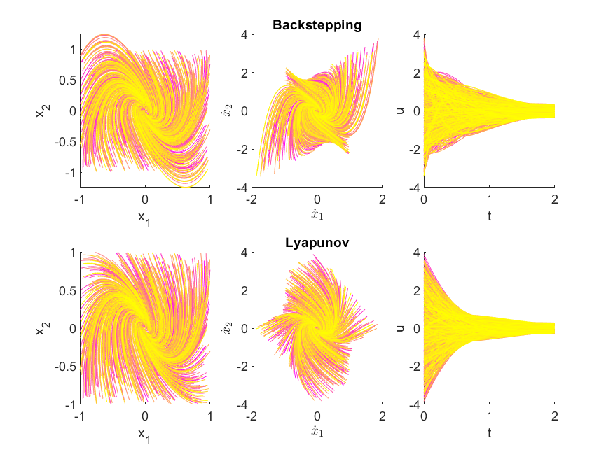

## Non-Linear Control

In this MATLAB-Script two feedback controllers for stabilizing a non-linear dynamical system are compared. The system is described by the following differential equation:

Control strategies:
* [**Backstepping control**](https://en.wikipedia.org/wiki/Backstepping)  Recursive design where in each step one state variable get's controled. The resulting closed loop system leads to asymptotic stability.
* [**Lyapuov based control**](https://en.wikipedia.org/wiki/Control-Lyapunov_function)  A positive definite "pseudo-energy" energy function =||&space;x&space;||^2) is defined. The control law aims to make the derivative of this function negative (semi-)definite. This leads to a closed loop system which loses energy over time.

Phase portrait:
